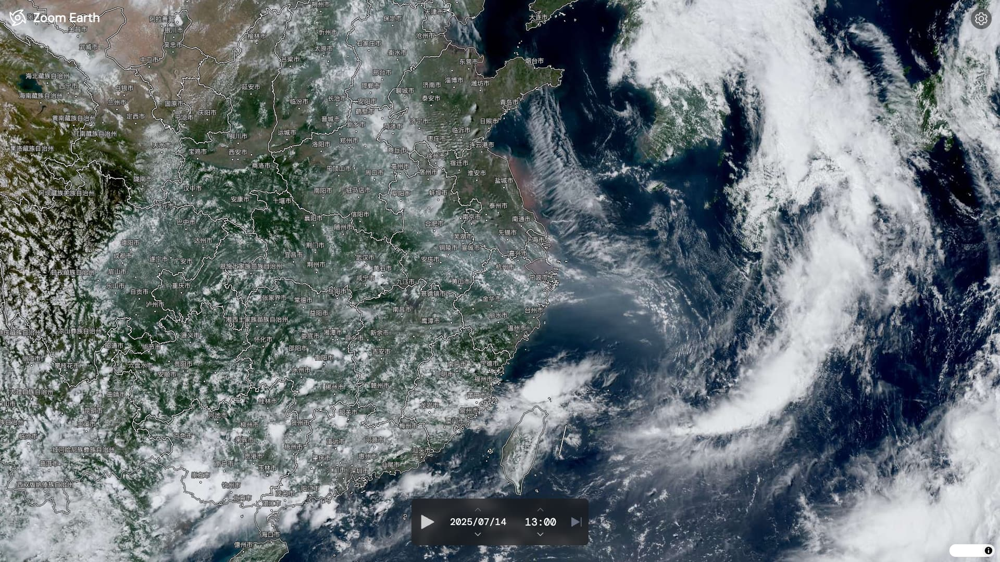

# 云图天气 Zoom Earth - 动态卫星云图查看器

[](https://opensource.org/licenses/MIT)
[](https://nuxt.com/)
[](https://github.com/unocss/unocss)
[](https://eslint.org/)

一个基于 Nuxt 3 和 MapLibre GL 构建的动态卫星云图查看器，灵感来源于 Zoom Earth，旨在提供流畅的地球天气动画体验。

<!-- 建议在此处替换为你的项目截图 -->



## ✨ 功能特性

- **动态卫星云图**: 实时加载并展示最新的 Himawari 卫星云图瓦片。
- **时间线动画**:
  - 支持播放、暂停、步进、跳转到最新时刻等完整的播放控制。
  - **两种播放模式**:
    - **快速模式**: 实时请求图像，即时播放，网络不佳时可能卡顿。
    - **平滑模式**: 首次播放前预加载动画序列所有图像，实现如丝般顺滑的无缝循环播放。
- **交互式时间选择**: 方便地按天、按时间点调整当前显示的云图。
- **可配置动画**: 在设置面板中，可以自由调整动画的播放速度、回溯时长、播放风格以及是否循环。
- **分级城市展示**: 根据地图的缩放级别，智能地显示不同级别的城市（省会 -> 主要城市），保持地图清爽。
- **现代化技术栈**: 使用 Nuxt 3、Vue 3、Pinia 和 Unocss 等前沿技术构建。
- **响应式设计**: 界面在桌面和移动设备上均有良好体验。
- **深色模式**: 支持一键切换浅色/深色主题。

## 🛠️ 技术栈

- **核心框架**: [Nuxt 3](https://nuxt.com/) - 提供服务端渲染(SSR)和静态站点生成(SSG)能力。
- **前端框架**: [Vue 3](https://vuejs.org/) - Composition API 驱动。
- **状态管理**: [Pinia](https://pinia.vuejs.org/) - 用于全局管理时间线、播放状态等。
- **样式方案**: [UnoCSS](https://github.com/unocss/unocss) - 原子化 CSS 引擎，即时生成，性能卓越。
- **地图库**: [MapLibre GL JS](https://maplibre.org/) - 用于渲染地理数据和栅格瓦片。
- **代码规范**: [@antfu/eslint-config](https://github.com/antfu/eslint-config) - 严格且统一的代码风格。
- **语言**: TypeScript

## 🚀 快速开始

### 1. 环境准备

确保你的开发环境中已安装 [Node.js](https://nodejs.org/) (v20+) 和 [pnpm](https://pnpm.io/)。

### 2. 克隆项目

```bash
git clone https://github.com/your-username/zoom-earth-map.git
cd zoom-earth-map
```

### 3. 安装依赖

```bash
pnpm install
```

### 4. 配置环境变量

项目需要一个 GIS 服务器来提供卫星图像的时间戳和瓦片。请在项目根目录创建一个 `.env` 文件，并配置以下变量：

```env
# .env

# 你的 GIS 服务器地址
NUXT_PUBLIC_GIS_SERVER_URL=http://localhost:8080
```

### 5. 运行开发服务器

```bash
pnpm dev
```

现在，应用应该已经在 `http://localhost:3000` 上运行。

## 📦 可用脚本

- `pnpm dev` - 启动开发服务器。
- `pnpm build` - 为生产环境构建项目。
- `pnpm preview` - 在本地预览生产环境构建后的成果。
- `pnpm lint` - 运行 ESLint 检查代码风格。
- `pnpm typecheck` - 运行 TypeScript 类型检查。

## 📦 部署

本项目支持多种部署方式。

### Netlify / Vercel (SPA 模式)

`netlify.toml` 文件已经预先配置好，可以直接将仓库链接到 Netlify 平台进行自动部署。这种方式会将项目构建为单页应用 (SPA)。

### Docker (SSR 模式)

项目包含一个多阶段构建的 `Dockerfile`，用于部署为服务端渲染 (SSR) 应用。

```bash
# 构建 Docker 镜像
docker build -t zoom-earth-map .

# 运行容器
docker run -d -p 3000:3000 --name zoom-earth-map-container zoom-earth-map
```

容器启动后，应用将在 `http://localhost:3000` 上提供服务。

## 📊 数据来源

- **卫星云图**: 时间戳和瓦片数据依赖于 `NUXT_PUBLIC_GIS_SERVER_URL` 所指向的外部 GIS 服务器。
- **城市标记**: 城市数据 (`public/new_data.json`) 是通过 `process_cities.py` 脚本对原始数据进行清洗、分级和增强（加入台湾省数据）后生成的。
- **国界数据**: 国界 GeoJSON 数据通过 Nuxt 服务端路由从 [阿里云 DataV](https://geo.datav.aliyun.com) 代理，以解决跨域问题并进行缓存。

## 📄 开源协议

本项目基于 [MIT License](https://opensource.org/licenses/MIT) 授权。
